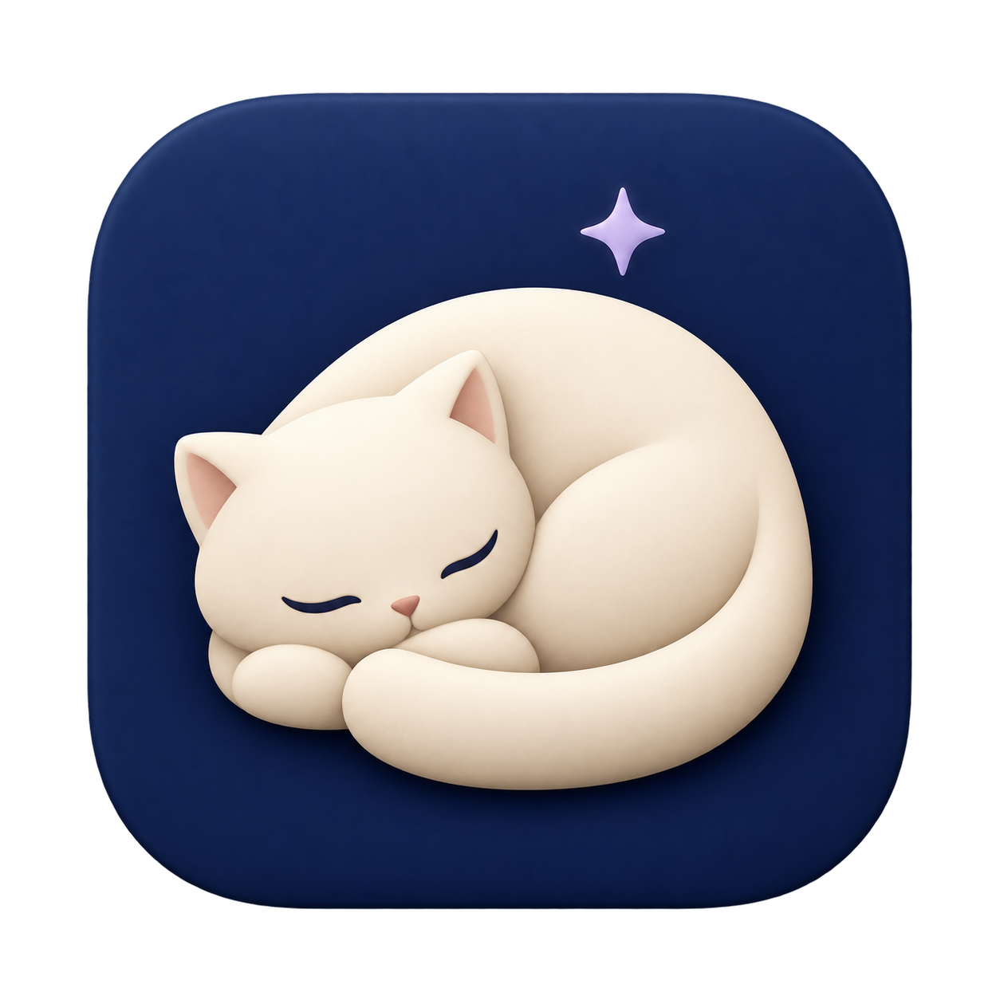
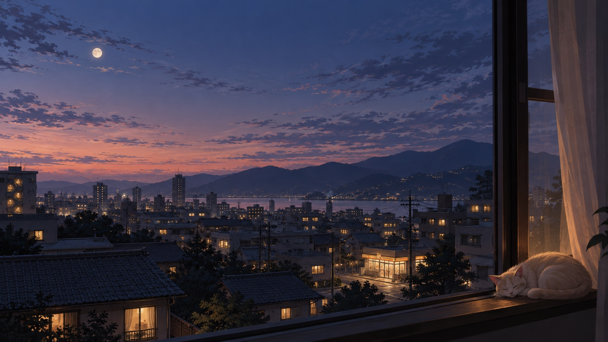
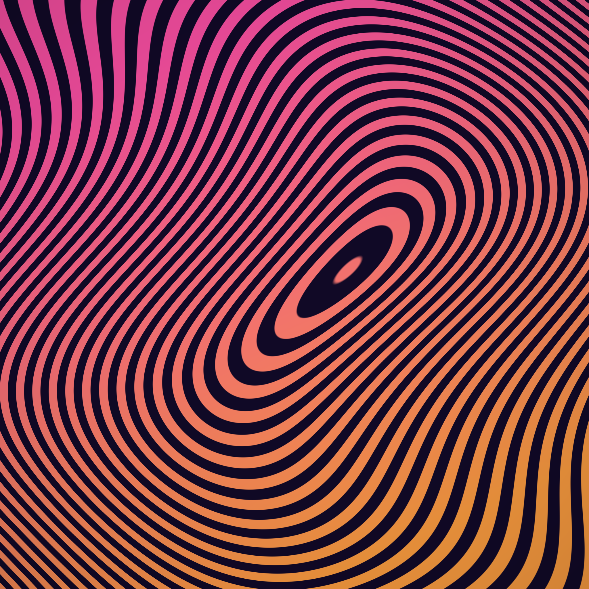

<p align="center">
  
</p>

<h1 align="center">Idlesse</h1>

<p align="center"><strong>A native Mac app for putting art, pictures, video, and animated scenes on the desktop — and letting them linger.</strong></p>

<p align="center">Library · Studio · Wallpaper · Screen Saver · Desktop Comfort</p>

Idlesse is a local-first macOS art display. Browse a personal Library, put a scene on the desktop, edit it in Studio, or use a folder of pictures as a traditional screen saver. Originals stay where they already live.

<p align="center">
  
  
</p>
<p align="center"><sub>Bundled sample artwork: After Hours · Undertow</sub></p>

## What it does

- **Library** — browse imported media and editable scenes, search, favorite, preview, organize collections, and send something to the desktop.
- **Wallpaper** — play still images, video, and procedural `.idlesse` scenes behind the desktop, with multi-display support and optional crossfades.
- **Studio** — compose layers, animate properties, use masks/blends/effects/particles/shaders, expose scene controls, and save reusable scene packages.
- **Screen Saver** — choose a folder, set long or short display times, shuffle or order pictures, fit/fill/actual-size them, and crossfade between them.
- **Desktop Comfort** — dim the desktop on a schedule and keep quieter display routines separate from the artwork itself.

The creative runtime supports images, video, gradients, nested groups, masks, blend modes, typed controls, keyframes, procedural signals, audio-reactive scenes, and bounded Metal shaders. See [scene format and limits](docs/scenes.md) for the detailed contract.

## Build

Requirements:

- macOS 14+
- Xcode command-line tools or Xcode
- Apple Silicon for the current development build

```sh
./build.sh
```

This produces:

```text
build/Idlesse.app
build/Idlesse.saver
```

Run the development app:

```sh
./build.sh run
```

With Glaeda's native Apple build helper installed, `glaeda-apple plan` shows the
selected cache generation and `glaeda-apple warm` builds the complete app through
the existing bundling/signing flow. The checked-in `glaeda.apple.json` separates
SwiftPM scratch, compiler modules, extension binaries, and app products by Apple
toolchain and build settings. It preserves the ordinary `build/` and `.build/`
flow for direct `build.sh` invocations. Private logs and generated products live
under `.glaeda/apple-build/`; builds do not launch the app automatically.

Install the screen saver locally:

```sh
./build.sh install
```

On macOS 26 Tahoe, find it under **System Settings → Wallpaper → Screen Saver → Custom → Other → Idlesse**.

## Try the examples

The repository includes small `.idlesse` scenes under [`Examples/`](Examples/), including gradients, particles, shader effects, animation controls, audio response, and layered compositions.

Useful starting points:

- [`AfterHours.idlesse`](Examples/AfterHours.idlesse) — image-based layered scene
- [`Undertow.idlesse`](Examples/Undertow.idlesse) — stylized scene with editable controls
- [`Fireflies.idlesse`](Examples/Fireflies.idlesse) — particle example
- [`AudioAurora.idlesse`](Examples/AudioAurora.idlesse) — opt-in audio response
- [`DeskClock.idlesse`](Examples/DeskClock.idlesse) — text/time-driven scene

## Current status

Idlesse is under active development. The app, scene runtime, Library, Studio, wallpaper host, and separate ScreenSaver-framework bundle all build today; beta packaging and distribution work continue. Local builds are development builds rather than notarized public releases.

For the live engineering detail, use the docs instead of this README:

| Area | Read this |
| --- | --- |
| Library and imports | [`docs/library.md`](docs/library.md) |
| Studio | [`docs/scene-preview.md`](docs/scene-preview.md) |
| Scene format/runtime | [`docs/scenes.md`](docs/scenes.md) |
| Desktop wallpaper | [`docs/wallpaper-prototype.md`](docs/wallpaper-prototype.md) |
| Screen saver / desktop comfort | [`docs/desktop-comfort.md`](docs/desktop-comfort.md) |
| Performance | [`docs/performance-2026-09-08.md`](docs/performance-2026-09-08.md) |
| Beta readiness | [`docs/beta-readiness.md`](docs/beta-readiness.md) |
| Verification | [`docs/runtime-qualification.md`](docs/runtime-qualification.md) |
| Building wallpapers from game assets | [`docs/wallpaper-pipeline.md`](docs/wallpaper-pipeline.md) |

## Philosophy

A desktop can hold a picture for longer than a few seconds. Idlesse is built around that idea: personal artwork, restrained playback, direct control, and enough creative machinery to make the desktop feel alive without turning it into a feed.
